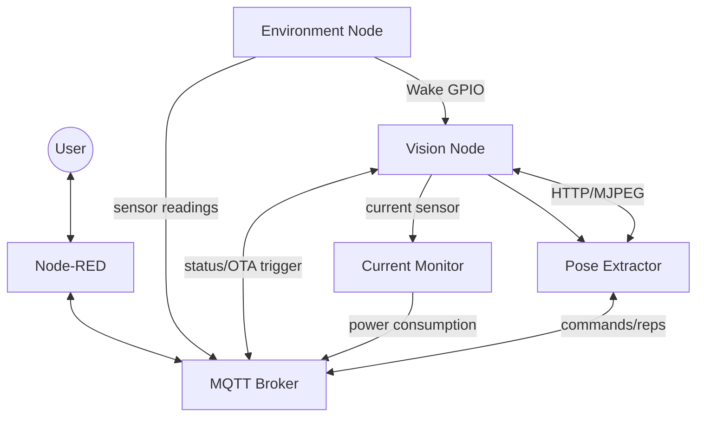

# Smart Home Gym

An internet-of-things system to monitor the environment and track exercises in a home gym. It combines environmental sensing and computer vision for automatic repetition counting, all orchestrated via a centralized local hub.

## System Architecture

The project relies on a local server to run the core intelligence and orchestration, while ESP32 microcontrollers are used as edge nodes.

## System Requirements

To run this project, you need:
*   **Hardware Devices:**
    *   ESP32-S3 (Tested for Environment Node)
    *   ESP32-CAM (Tested for Vision Node)
    *   ESP8266 + INA219 (Optional, for Current Monitor)
    *   Local Server / PC (Linux tested) connected via Ethernet/Wi-Fi.
*   **Software / Backend:**
    *   MQTT Broker (e.g. Mosquitto) running on the local server.
    *   Node-RED (for orchestration and user dashboard).
    *   Python 3.x (for the Pose Extractor).
    *   ESP-IDF v5.x (for compiling ESP32 firmwares).
    *   Arduino IDE (for compiling the current monitor).

## Project Structure

*   `/environment-sensors-node`: ESP-IDF project for the ESP32-S3. Manages sensors (SHT31, MQ7, MQ135, PMS5003, PIR) to monitor air quality, temperature, and detect user presence, acting as a hardware trigger to wake up the Vision Node.
*   `/vision-node`: ESP-IDF project for the ESP32-CAM. Remains in deep-sleep until triggered by the Environment Node. Serves an MJPEG video stream over an HTTP endpoint when recording is requested.
*   `/pose-extractor`: Python backend application. Consumes the MJPEG stream from the Vision Node, utilizes MediaPipe Pose to track human joints, and runs a finite-state machine to count repetitions and identify exercises (Squat, RDL, Lateral Raise, Bicep Curl).
*   `/node-red-orchestrator`: Node-RED flows definition. Acts as the central hub, providing a user dashboard to view metrics, control the system (start/stop recording), and calculate the "Stress Index" based on environment and exercise intensity.
*   `/current-monitor-node`: Arduino project for an ESP8266. Validates the Vision Node's power consumption across its different states (Deep Sleep, Awake Idle, Awake Streaming) using an INA219 sensor.

(See the specific `README.md` files in each subfolder for detailed technical instructions).

For further information please refer to the detailed report (`report.pdf`).