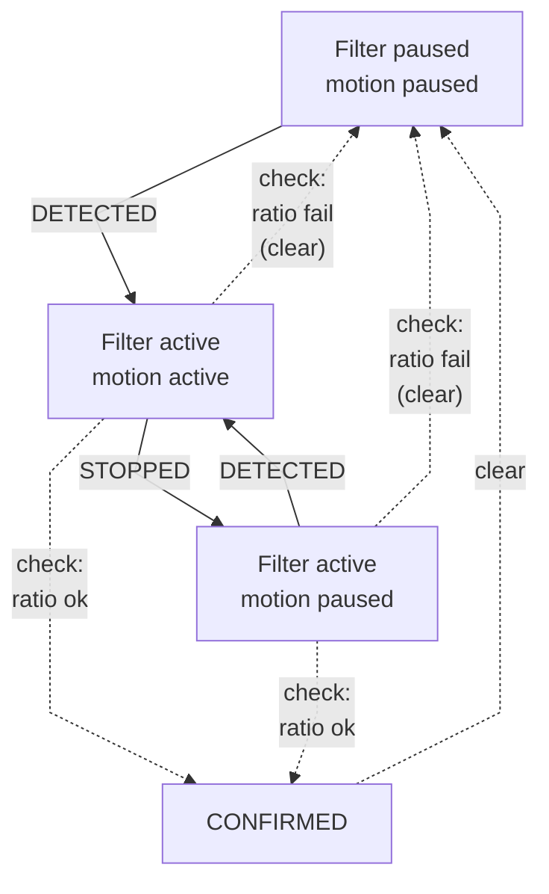

# Environment Sensors Node

This directory contains the firmware for the **ESP32-S3** microcontroller serving as the environment monitoring hub. Built with **ESP-IDF** (v5.x), it leverages a modular architecture where each sensor operates via independent tasks or components.

## Hardware Components & Sensors

*   **SHT31:** Measures Temperature and Humidity (via I2C).
*   **MQ7 & MQ135:** Analog sensors measuring CO and general Air Quality, respectively (via internal ADC).
*   **PMS5003:** Measures Particulate Matter, parsed using a custom UART decoder.
*   **HC-SR501 (PIR):** Detects motion (via GPIO ISR).
*   **Feedback:** Buzzer and LEDs indicate system states and warnings.

## Architecture and Logic

The node continually reads and aggregates metrics from the sensors, smoothing noisy data using a moving-average filter. The filtered telemetry is pushed to the MQTT broker periodically.

### PIR Software Filter FSM

The PIR sensor data is notoriously noisy. To prevent false wake-up triggers to the Vision Node, a dedicated software filter is implemented based on a Finite-State Machine (FSM) and a continuous activation ratio.



Only when the state reaches `CONFIRMED`, the Environment Node drives a dedicated GPIO line **HIGH** to wake up the Vision Node, maintaining it high until a timeout occurs.

## Build and Flash

This is a standard ESP-IDF project.

```bash
idf.py set-target esp32s3
idf.py build
idf.py -p /dev/ttyUSB0 flash monitor
```
