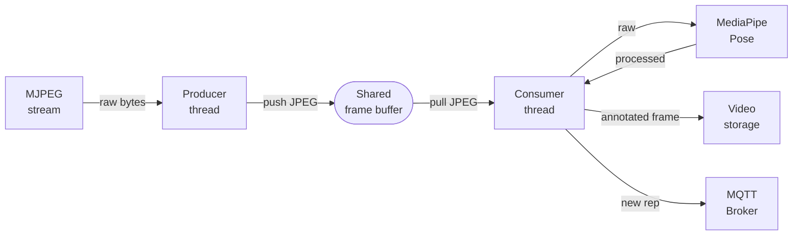
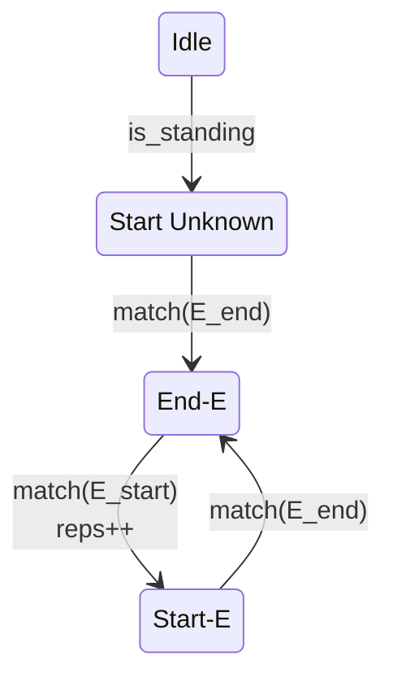
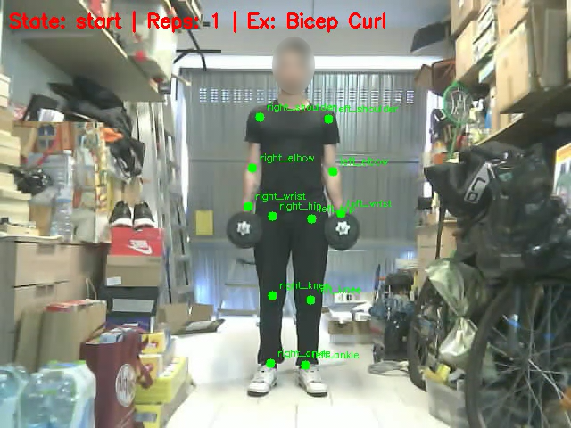
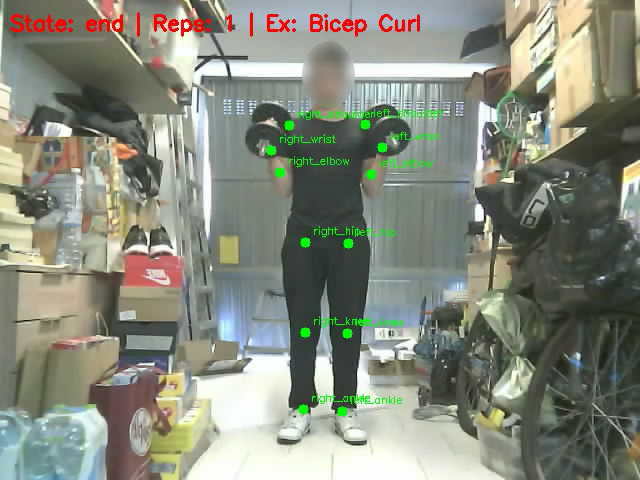

# Pose Extractor

The Pose Extractor acts as the core computer vision intelligence of the system. Written in Python 3, it consumes the MJPEG stream provided by the Vision Node and applies Machine Learning to track user exercises.

## Architecture

To prevent tracking delays and frame dropping, the application uses a multithreaded architecture featuring a shared frame buffer:

*   **Producer Thread:** Continuously reads raw MJPEG byte chunks from the HTTP stream and decodes them.
*   **Consumer Thread:** Pulls frames from the shared buffer, applies the AI model, and processes the application logic.



## AI and Exercise Tracking

The application uses **MediaPipe Pose** to track human joint landmarks (shoulders, elbows, wrists, hips, knees, ankles). An internal Finite-State Machine (FSM) is driven by the geometric angles formed by these joints to successfully classify and count repetitions.



For instance, a Bicep Curl is evaluated based on the following start and end positions:

### Start Position


### End Position


**Supported Exercises:**
*   Squat
*   Romanian Deadlift (RDL)
*   Lateral Raise
*   Bicep Curl

The application listens to the `start_rec` MQTT command to begin extracting frames, and publishes completed repetition counts back to the MQTT Broker in real-time. Additionally, it can record and store annotated videos locally.

## Setup

```bash
pip install -r requirements.txt
python pose-extractor.py
```
*(Alternatively, use `docker compose up -d --build`).*